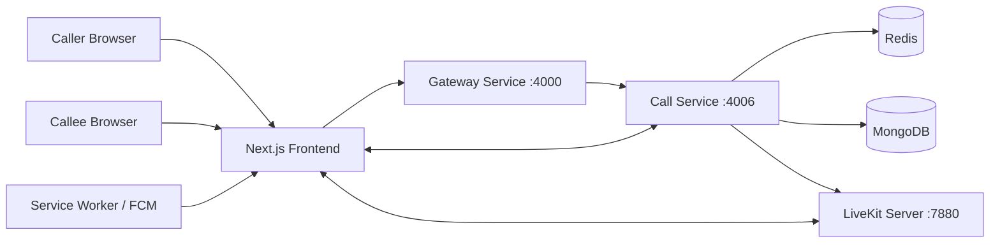
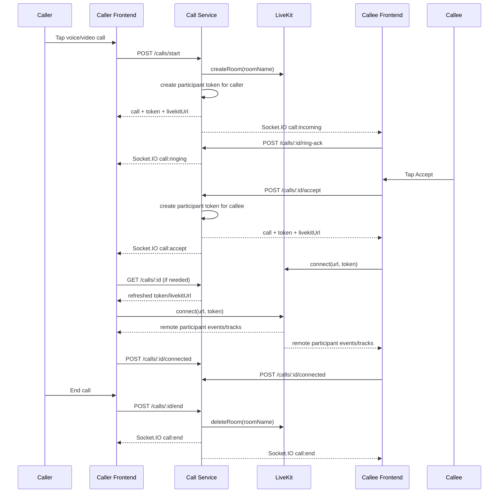

# LiveKit Implementation Guide

> **No longer this repo's architecture (as of 2026-08-05).** TailCircle
> removed LiveKit and now runs video consults on direct browser-to-browser
> WebRTC signalled over Socket.IO — see `tool/VIDEO_CALL_FEATURE.md` for the
> current design and `backend/turn/README.md` for the TURN/STUN piece that
> remains. This guide is kept as a reference for the LiveKit integration
> pattern itself (accurate as a description of *how LiveKit was integrated*),
> not as documentation of what this codebase currently does.

Production reference for reusing the AppMetaChat LiveKit calling integration in future projects.

This document is based on the current implementation in this repository. It only documents behavior that is directly evidenced in source, configuration, lockfiles, and project docs. Where something is not implemented or cannot be confirmed from code, that is called out explicitly instead of inferred.

## Table Of Contents

1. [Project Overview](#1-project-overview)
2. [Installation Guide](#2-installation-guide)
3. [Package Analysis](#3-package-analysis)
4. [Initial Project Setup](#4-initial-project-setup)
5. [Environment Variables](#5-environment-variables)
6. [Credentials Flow](#6-credentials-flow)
7. [Ports And Local Development](#7-ports-and-local-development)
8. [Folder Structure](#8-folder-structure)
9. [Complete Code Flow](#9-complete-code-flow)
10. [API Documentation](#10-api-documentation)
11. [Authentication Flow](#11-authentication-flow)
12. [Frontend Implementation](#12-frontend-implementation)
13. [Backend Implementation](#13-backend-implementation)
14. [Feature Inventory](#14-feature-inventory)
15. [Event Flow](#15-event-flow)
16. [State Management](#16-state-management)
17. [Error Handling](#17-error-handling)
18. [Configuration](#18-configuration)
19. [Sequence Diagram](#19-sequence-diagram)
20. [Reusable Implementation Guide](#20-reusable-implementation-guide)
21. [Migration Checklist](#21-migration-checklist)
22. [Common Mistakes And Things To Watch Out For](#22-common-mistakes-and-things-to-watch-out-for)
23. [Deployment Guide](#23-deployment-guide)
24. [Best Practices](#24-best-practices)
25. [Instructions For Future AI Assistants](#25-instructions-for-future-ai-assistants)

## 1. Project Overview

### Why LiveKit is used

AppMetaChat uses LiveKit as the media layer for real-time voice and video calls. The project separates calling into two independent concerns:

- Signaling and call business logic: call start, ringing, accept, reject, busy, reconnect grace, logs, call history, push notifications, and state transitions.
- Media transport: actual WebRTC audio, video, and screen share tracks.

LiveKit solves the media problem so the application does not have to implement custom SFU behavior, participant track routing, or direct peer-to-peer reliability logic.

### What problem it solves

Without LiveKit, the app would need to implement:

- WebRTC room orchestration
- Track publish and subscribe behavior
- multi-participant media routing
- reconnect logic at the media layer
- server-side room and participant administration

Instead, the application backend only creates rooms, generates participant tokens, and administers rooms through the LiveKit server SDK. Browsers connect directly to LiveKit for media.

### Currently implemented LiveKit-backed features

Confirmed from code:

- 1:1 voice calls
- 1:1 video calls
- group voice calls
- group video calls
- room pre-creation on call start
- token generation per participant
- direct browser-to-LiveKit connection
- microphone publish
- camera publish
- screen sharing
- remote audio playback
- remote video rendering
- participant join/leave handling
- reconnect and recovery logic
- group participant rejoin and leave semantics
- self-hosted LiveKit server support
- reverse-proxy WSS deployment example

Not found in code:

- LiveKit webhooks
- server-side recording or egress
- SIP or telephony
- data-channel chat features specific to LiveKit
- use of `@livekit/components-react`
- device selection UI for choosing specific microphones/cameras/speakers
- explicit active speaker UI
- explicit network quality UI
- codec-specific UI or custom transcoding controls

### High-level architecture

The system uses a hybrid model:

- REST API for deterministic state changes and hydration
- Socket.IO for low-latency signaling events
- LiveKit WebRTC for media
- Redis for active-call state and busy locks
- MongoDB for persisted call history and participant state
- Firebase/service worker for background incoming call delivery



### Frontend, backend, and LiveKit communication model

1. The frontend starts or answers a call through the gateway API.
2. The gateway proxies `/api/v1/calls/*` to `call-service`.
3. `call-service` validates auth, checks business rules, creates or reuses a call room, and mints a LiveKit participant JWT.
4. `call-service` pushes signaling events over Socket.IO.
5. The frontend connects directly to LiveKit using `livekit-client`.
6. Once media is established, the frontend acknowledges connection back to `call-service`.
7. Call end, leave, reject, reconnect, and participant events flow through `call-service`, not through LiveKit alone.

## 2. Installation Guide

### Package manager

This repo uses `npm`.

Evidence:

- `frontend/package-lock.json`
- `backend/package-lock.json`
- `backend/call-service/package-lock.json`
- CI uses `npm ci`

### Node version

Confirmed:

- CI uses Node `20` in `.github/workflows/quality-gates.yml`
- `livekit-server-sdk` resolved version requires Node `>=18`

Not found:

- no `.nvmrc`
- no `.node-version`
- no `engines` field in the app package manifests

Recommendation for reuse:

```bash
node --version
# Use Node 20.x to match CI and exceed LiveKit server SDK minimum.
```

### Exact LiveKit-related packages in the current app

Frontend runtime:

- `livekit-client` declared `^2.20.1`, resolved `2.20.1`

Backend runtime:

- `livekit-server-sdk` declared `^2.9.1` in `backend/call-service/package.json`
- `livekit-server-sdk` resolved `2.17.0` in `backend/call-service/package-lock.json`
- `livekit-server-sdk` also exists in `backend/package.json` as `^2.17.0`

Important caveat:

The call-service manifest and lockfile are inconsistent. The actual installed runtime version evidenced by the lockfile is `2.17.0`. Future projects should pin to the resolved version if exact reproducibility matters.

### Inferred install commands

Because only manifests and lockfiles are available, these commands are inferred from the installed dependencies:

```bash
# Frontend
cd frontend
npm install livekit-client@2.20.1

# Backend call service
cd ../backend/call-service
npm install livekit-server-sdk@2.17.0
```

If you want to mirror the manifests exactly rather than the lockfile:

```bash
cd backend/call-service
npm install livekit-server-sdk@^2.9.1
```

That is not the exact currently resolved runtime, so the pinned `2.17.0` command is safer for faithful reproduction.

### Self-hosted LiveKit server installation

The repo includes two supported local server setups:

#### Option A: Docker

```bash
cd backend/livekit
docker compose up -d
```

#### Option B: Windows binary

Documented in `backend/livekit/README.md`:

1. Download the latest Windows LiveKit server binary.
2. Extract `livekit-server.exe` into `backend/livekit/`.
3. Start it with the repo's `livekit.yaml`.

```powershell
cd d:\Github\AppMetaChat\backend\livekit
.\livekit-server.exe --config .\livekit.yaml --bind 0.0.0.0
```

### Why each package exists

- `livekit-client`: browser SDK for connecting to a LiveKit room, publishing local tracks, receiving remote tracks, and handling room events.
- `livekit-server-sdk`: backend SDK for room creation, participant token generation, room deletion, participant removal, and participant listing.
- `socket.io-client`: not a LiveKit package, but mandatory in this architecture because signaling is not delegated to LiveKit.
- `zod`: not a LiveKit package, but used to validate call API payloads.
- `firebase`: not a LiveKit package, but used for background incoming call notification flow.

### Peer and optional dependencies

Confirmed:

- `livekit-client@2.20.1` has a peer dependency on `@types/dom-mediacapture-record@^1`
- That peer is type-related only and not required at runtime in this JavaScript project
- No explicit LiveKit-specific optional dependency is declared in the examined LiveKit package sections

## 3. Package Analysis

### `livekit-client`

- Purpose: client-side WebRTC room SDK
- Declared version: `^2.20.1`
- Resolved version: `2.20.1`
- Where declared: `frontend/package.json`
- Where used:
  - `frontend/src/contexts/CallContext.js`
- Why required:
  - creates `Room`
  - handles `RoomEvent.*`
  - publishes microphone, camera, and screen share
  - attaches remote audio/video tracks to DOM elements

### `livekit-server-sdk`

- Purpose: server-side room admin and JWT generation
- Declared version in call-service: `^2.9.1`
- Resolved version in call-service lockfile: `2.17.0`
- Declared version in backend root: `^2.17.0`
- Where declared:
  - `backend/call-service/package.json`
  - `backend/package.json`
- Where used:
  - `backend/call-service/src/services/livekit.js`
- Why required:
  - `AccessToken` for participant JWT generation
  - `RoomServiceClient` for room create/delete/remove/list

### Packages not used

Not found anywhere in imports:

- `@livekit/components-react`
- `@livekit/components-core`
- egress/recording plugins
- telephony/SIP-related LiveKit packages

That means the frontend UI is custom-built over `livekit-client`, not based on LiveKit's React component library.

## 4. Initial Project Setup

### How LiveKit was integrated in this project

The implementation follows a layered rollout:

1. A standalone `call-service` owns call domain logic.
2. A `backend/livekit/` directory stores self-hosted LiveKit server configs and deployment helpers.
3. `backend/call-service/src/services/livekit.js` wraps the LiveKit server SDK.
4. `callService.js` orchestrates room creation, token generation, and cleanup.
5. `frontend/src/contexts/CallContext.js` owns all calling state and LiveKit room lifecycle.
6. `CallOverlay.js` renders the call UI globally.
7. Socket.IO and FCM/service-worker flows fill in signaling and background notification behavior.

### First-level configuration pattern

Backend:

- require and validate `LIVEKIT_API_KEY`, `LIVEKIT_API_SECRET`, `LIVEKIT_URL`
- derive `LIVEKIT_HTTP_URL` from `LIVEKIT_URL` when omitted
- validate external IP and TURN/STUN production warnings

Frontend:

- expose `NEXT_PUBLIC_LIVEKIT_URL`
- expose `NEXT_PUBLIC_CALL_SOCKET_URL`
- default to localhost values in dev

### Dependency flow

```text
frontend UI
  -> callApi / callSocketClient
  -> gateway
  -> call-service
  -> livekit service wrapper
  -> LiveKit server SDK
  -> LiveKit SFU

frontend UI
  -> livekit-client
  -> LiveKit SFU directly
```

## 5. Environment Variables

### Backend variables

#### `LIVEKIT_API_KEY`

- Purpose: signs LiveKit participant tokens and authenticates Room API calls
- Used in:
  - `backend/call-service/src/config/index.js`
  - `backend/call-service/src/services/livekit.js`
  - `backend/shared/calls/livekitConfig.js`
- Scope: backend only
- Required: yes
- Example format: `devkey` or a production API key string
- Security: secret-adjacent, do not expose to frontend

#### `LIVEKIT_API_SECRET`

- Purpose: secret used with `LIVEKIT_API_KEY` to sign participant JWTs
- Used in:
  - `backend/call-service/src/config/index.js`
  - `backend/call-service/src/services/livekit.js`
  - `backend/shared/calls/livekitConfig.js`
- Scope: backend only
- Required: yes
- Example format: `secret` in dev, strong random secret in prod
- Security: highly sensitive, must never reach the browser

#### `LIVEKIT_URL`

- Purpose: LiveKit signaling URL returned to clients and used by health/config checks
- Used in:
  - `backend/call-service/src/config/index.js`
  - `backend/call-service/src/services/livekit.js`
  - `backend/shared/calls/livekitConfig.js`
- Scope: backend
- Required: yes
- Example values:
  - dev: `ws://localhost:7880`
  - prod: `wss://livekit.example.com`
- Security: public endpoint, not secret

#### `LIVEKIT_HTTP_URL`

- Purpose: HTTP origin used by the server-side Room API client
- Used in:
  - `backend/call-service/src/config/index.js`
  - `backend/call-service/src/services/livekit.js`
- Scope: backend only
- Required: optional, but effectively recommended
- Fallback behavior: derived by replacing `ws` with `http` from `LIVEKIT_URL`
- Example values:
  - dev: `http://127.0.0.1:7880`
  - prod: `http://127.0.0.1:7880` when nginx terminates TLS externally
- Security: internal-only preferred
- Important caveat: if omitted, the code derives it from `LIVEKIT_URL` by replacing `ws` with `http`, which is convenient but may not be the correct control-plane URL for every production deployment unless explicitly overridden

#### `LIVEKIT_USE_EXTERNAL_IP`

- Purpose: backend-side config validation flag warning that production should advertise public IP for mobile/WebRTC traversal
- Used in:
  - `backend/shared/calls/livekitConfig.js`
  - loaded through `backend/call-service/src/config/index.js`
- Scope: backend
- Required: optional
- Example value: `true`
- Security: not secret

#### `TURN_URLS`

- Purpose: operational documentation and config validation for TURN relays
- Used in:
  - `backend/shared/calls/livekitConfig.js`
  - commented in `backend/call-service/.env.example`
- Scope: backend/ops
- Required: optional in code, strongly recommended in production mobile scenarios
- Example format:
  - `turn:turn.example.com:3478?transport=udp,turns:turn.example.com:5349?transport=tcp`

#### `STUN_URLS`

- Purpose: optional STUN server list
- Used in:
  - `backend/shared/calls/livekitConfig.js`
- Scope: backend/ops
- Required: optional
- Example format:
  - `stun:stun.l.google.com:19302`

### Frontend variables

#### `NEXT_PUBLIC_LIVEKIT_URL`

- Purpose: client fallback LiveKit URL when the backend-provided URL is loopback or absent
- Used in:
  - `frontend/src/config/index.js`
  - `frontend/src/contexts/CallContext.js`
- Scope: frontend
- Required: strongly recommended
- Example values:
  - dev: `ws://localhost:7880`
  - prod: `wss://livekit.example.com`
- Security: public by design

#### `NEXT_PUBLIC_CALL_SOCKET_URL`

- Purpose: Call Socket.IO endpoint for signaling
- Used in:
  - `frontend/src/config/index.js`
  - `frontend/src/contexts/CallContext.js`
- Scope: frontend
- Required: yes for calling features
- Example values:
  - dev direct service: `http://localhost:4006`
  - prod reverse proxy mount: `https://app.example.com/call-socket`

#### `NEXT_PUBLIC_API_URL`

- Purpose: gateway API base for all REST calls, including `/calls`
- Used in:
  - `frontend/src/config/index.js`
  - `frontend/src/services/common/apiClient.js`
- Scope: frontend
- Required: yes for production correctness

### Related but not LiveKit-specific env

- `JWT_SECRET`: required because call-service and call socket auth depend on the app auth JWT
- `INTERNAL_SERVICE_SECRET`: required for service-to-service auth between `call-service` and `chat-service`
- `CALL_SERVICE_URL`: gateway proxy target
- `PORT`: service port
- `CALL_RING_TIMEOUT_MS`, `CALL_RECONNECT_GRACE_MS`, `CALL_EMPTY_ROOM_TIMEOUT_MS`, and related call lifecycle timers
- `CALL_PARTICIPANT_JOIN_TIMEOUT_MS`: exported by backend config, but no active runtime consumer was confirmed in the current codebase
- Firebase public envs for incoming-call background notifications

### Local development setup

Backend example from `backend/call-service/.env.example`:

```env
LIVEKIT_API_KEY=devkey
LIVEKIT_API_SECRET=secret
LIVEKIT_URL=ws://localhost:7880
LIVEKIT_HTTP_URL=http://127.0.0.1:7880
```

Frontend example inferred from config and docs:

```env
NEXT_PUBLIC_LIVEKIT_URL=ws://localhost:7880
NEXT_PUBLIC_CALL_SOCKET_URL=http://localhost:4006
NEXT_PUBLIC_API_URL=http://localhost:4000/api/v1
```

### Production setup

Confirmed pattern from `backend/livekit/nginx-livekit.conf.example`:

```env
LIVEKIT_URL=wss://livekit.appmetachat.com
LIVEKIT_HTTP_URL=http://127.0.0.1:7880
NEXT_PUBLIC_LIVEKIT_URL=wss://livekit.appmetachat.com
NEXT_PUBLIC_CALL_SOCKET_URL=https://appmetachat.com/call-socket
```

Production also expects:

- `rtc.use_external_ip: true` in `livekit.yaml`
- TCP 7881 and UDP 50000-50100 open
- HTTPS/WSS termination through nginx

### Staging setup

No dedicated staging files were found. For staging, use the same production pattern with staging hostnames and separate API keys/secrets.

### Documentation gaps worth fixing in future projects

Observed in this repository:

- `backend/call-service/.env.example` documents LiveKit keys but does not document `INTERNAL_SERVICE_SECRET`
- `backend/gateway-service/.env.example` omits `CALL_SERVICE_URL` even though gateway config supports it

## 6. Credentials Flow

### Where the API key and secret come from

They come from:

- `backend/livekit/livekit.yaml` for the LiveKit server
- matching values in `backend/call-service/.env`

The dev example uses:

```yaml
keys:
  devkey: secret
```

and

```env
LIVEKIT_API_KEY=devkey
LIVEKIT_API_SECRET=secret
```

These must match or LiveKit will reject the participant token.

### Who generates tokens

`call-service` generates LiveKit participant JWTs through `livekit-server-sdk` in `backend/call-service/src/services/livekit.js`.

### How tokens are generated

`createParticipantToken(userId, displayName, roomName, { canPublish = true })`:

- creates `new AccessToken(apiKey, apiSecret, { identity, name, ttl: "2h" })`
- adds grant:
  - `roomJoin: true`
  - `room: roomName`
  - `canPublish`
  - `canSubscribe: true`
  - `canPublishData: true`

### How the frontend receives tokens

Tokens are returned in REST responses from `call-service`, most importantly:

- `POST /calls/start` for the initiator
- `POST /calls/:id/accept` for the callee
- `GET /calls/:id` for hydration/rejoin/refresh
- `GET /calls/active` for recovery of current call state

### How authentication works

There are two independent auth layers:

1. App auth JWT:
   - used for REST API authorization
   - used for Socket.IO authorization
   - verified by `backend/shared/middleware/authMiddleware.js`
   - also verified for call socket handshakes in `backend/call-service/src/socket/handler.js`

2. LiveKit participant JWT:
   - generated by `call-service`
   - used only for joining a LiveKit room
   - never generated in the browser

### How authorization works

App-level authorization determines whether a user may:

- start a call
- accept a call
- reject a call
- leave or end a call
- fetch call state

LiveKit-level authorization determines which room the participant can join and whether they can publish/subscribe.

### Token expiration

LiveKit token TTL is explicitly set to `2h`.

### Reconnect behavior

The frontend stores the last good LiveKit credentials in `livekitCredsRef`.

If the room disconnects:

- the frontend may fetch fresh call state using `callApi.get(callId)`
- if a fresh token is returned, it reconnects with that
- otherwise it falls back to cached token and URL

The app JWT is also proactively refreshed via `ensureFreshAccessToken()` before call hydration requests.

## 7. Ports And Local Development

### Confirmed service ports

- gateway-service: `4000`
- auth-service: `4001`
- user-service: `4002`
- chat-service: `4003`
- upload-service: `4005`
- call-service: `4006`
- LiveKit signaling/HTTP: `7880`
- LiveKit RTC TCP: `7881`
- LiveKit media UDP: `50000-50100`

### Local URLs

- frontend dev: `http://localhost:5173`
- gateway API: `http://localhost:4000/api/v1`
- call-service direct: `http://localhost:4006`
- LiveKit dev: `ws://localhost:7880`
- LiveKit Room API HTTP: `http://127.0.0.1:7880`

### Production URL pattern

- frontend app: `https://app.example.com`
- gateway API: `https://app.example.com/api/v1`
- call socket proxy mount: `https://app.example.com/call-socket`
- LiveKit WSS: `wss://livekit.example.com`

### Communication paths

- REST calls: browser -> gateway -> call-service
- call socket: browser -> call-service directly or via reverse-proxy path
- LiveKit media: browser -> LiveKit directly
- LiveKit Room API: call-service -> LiveKit internal HTTP endpoint

## 8. Folder Structure

### Backend LiveKit-related files

#### `backend/call-service/src/services/livekit.js`

- Purpose: wrapper around `livekit-server-sdk`
- Responsibilities:
  - create room
  - mint participant token
  - delete room
  - remove participant
  - list participants
- Imported by: `backend/call-service/src/services/callService.js`

#### `backend/call-service/src/services/callService.js`

- Purpose: main call domain service
- Responsibilities:
  - start/accept/reject/cancel/end/leave call
  - interact with LiveKit wrapper
  - manage timers and reconnect behavior
  - emit Socket.IO events
  - persist call and participant state
- Imported by:
  - `backend/call-service/src/controllers/call.js`
  - `backend/call-service/src/socket/handler.js`

#### `backend/call-service/src/config/index.js`

- Purpose: required env loading and validation
- Responsibilities:
  - load `.env`
  - validate mandatory LiveKit config
  - derive `httpUrl`
  - surface TURN/STUN and external IP flags

#### `backend/shared/calls/livekitConfig.js`

- Purpose: shared validation helper for LiveKit env and TURN/STUN ops settings
- Responsibilities:
  - validate required LiveKit env
  - emit production warnings for external IP and TURN absence

#### `backend/call-service/src/routes/call.js`

- Purpose: REST endpoints for call operations
- Imported by: `backend/call-service/src/app.js`

#### `backend/call-service/src/controllers/call.js`

- Purpose: HTTP controller layer
- Responsibilities:
  - request validation with `zod`
  - calling `callService`
  - standard response envelope

#### `backend/call-service/src/socket/handler.js`

- Purpose: Socket.IO signaling auth and event handling
- Responsibilities:
  - verify socket JWT
  - bind per-user rooms
  - handle call socket events

#### `backend/call-service/src/socket/callAcl.js`

- Purpose: participant membership ACL helper
- Responsibility: confirms a user belongs to a call's `participantIds`

#### `backend/call-service/src/services/callState.js`

- Purpose: Redis-backed active-call registry and call transition helper
- Responsibilities:
  - per-call active state
  - per-user busy locks
  - per-conversation active group call binding
  - redis transition guard

#### `backend/call-service/src/models/call.js`

- Purpose: persistent call record

#### `backend/call-service/src/models/callParticipant.js`

- Purpose: per-participant state in a call

#### `backend/livekit/livekit.yaml`

- Purpose: self-hosted LiveKit server configuration

#### `backend/livekit/docker-compose.yml`

- Purpose: local/prod-adjacent self-hosted LiveKit launch

#### `backend/livekit/nginx-livekit.conf.example`

- Purpose: production WSS reverse-proxy example

#### `backend/livekit/README.md`

- Purpose: operational instructions for Docker and Windows binary setup

#### `backend/livekit/turnserver.conf.example`

- Purpose: example coturn configuration for restrictive NAT/mobile-network support

### Frontend LiveKit-related files

#### `frontend/src/contexts/CallContext.js`

- Purpose: central frontend call state and LiveKit room lifecycle manager
- Responsibilities:
  - start/accept/reject/end/leave flows
  - connect to LiveKit
  - attach local and remote tracks
  - reconnect logic
  - socket event handling
  - background hydration

#### `frontend/src/components/call/CallOverlay.js`

- Purpose: full-screen and minimized call UI
- Responsibilities:
  - render call states
  - render remote/local video
  - render controls
  - manage ringtone ownership UI behaviors

#### `frontend/src/components/call/IncomingCallBanner.js`

- Purpose: compact incoming-call banner

#### `frontend/src/components/call/CallOverlayHost.js`

- Purpose: lazy-load global call overlay client-side and unlock ringtone after first user gesture

#### `frontend/src/services/call/callApi.js`

- Purpose: REST client wrapper for call endpoints

#### `frontend/src/lib/callSocket.js`

- Purpose: Socket.IO client wrapper for call signaling
- Responsibilities:
  - reverse-proxy path normalization
  - auth token attachment
  - controlled reconnect behavior

#### `frontend/src/lib/mediaCapabilities.js`

- Purpose: screen share capability gating and error message normalization

#### `frontend/src/lib/callTabSync.js`

- Purpose: cross-tab call leadership and synchronization

#### `frontend/src/lib/incomingCallNotify.js`

- Purpose: service-worker notification helper for incoming calls

#### `frontend/public/firebase-messaging-sw.js`

- Purpose: background incoming-call notification handling
- Responsibilities:
  - show call notifications
  - post incoming-call messages to clients
  - handle Accept/Decline notification actions

#### `frontend/src/config/index.js`

- Purpose: frontend endpoint config including `LIVEKIT_URL` and `CALL_SOCKET_URL`

#### `frontend/src/components/providers/WebAppProviders.js`

- Purpose: mounts `CallProvider` globally and renders `CallOverlayHost`

#### `frontend/src/app/calls/page.js`

- Purpose: call logs and outbound call entry UI
- Uses `useCallActions()` to start voice/video calls

## 9. Complete Code Flow

### Outgoing 1:1 call

1. User triggers `startVoiceCall()` or `startVideoCall()` in `CallContext`.
2. Frontend calls `POST /calls/start`.
3. `call-service`:
   - validates auth and payload
   - checks busy state in Redis
   - creates a unique room name `call_<callId>`
   - calls `livekit.ensureRoom(roomName, { maxParticipants: 2 })`
   - stores call state in Mongo and Redis
   - creates initiator LiveKit token
   - emits `call:incoming` and `call:ringing` to callee when online
   - returns call payload including `token` and `livekitUrl`
4. Frontend keeps showing dialing UI.
5. For 1:1, the caller does not pre-join LiveKit during ringing.
6. Callee UI sends `ring-ack` once incoming UI is shown.
7. Server promotes call from `calling` to `ringing`.
8. On accept, server returns callee token and emits `call:accept`.
9. Caller fetches fresh call state if needed and connects to LiveKit.
10. Both parties connect to LiveKit, publish mic, optionally camera.
11. Frontend sends `connected` ack to backend.
12. Backend marks call `connected`.

### Outgoing group call

1. User triggers `startGroupCall({ conversationId, type })`.
2. Backend validates group conversation membership.
3. Backend creates room with max participants capped by group size and `CALL_GROUP_MAX_PARTICIPANTS`.
4. Initiator immediately receives a token.
5. Frontend may pre-join LiveKit while the group is still ringing.
6. Invitees receive incoming signaling and can join later.
7. Additional group participants accepting after call start get fresh tokens for the same room.

### Incoming call accept

1. Frontend receives `call:incoming` or FCM/service-worker wake-up.
2. Frontend hydrates state via `GET /calls/:id` or `GET /calls/active` if needed.
3. User taps Accept.
4. Frontend calls `POST /calls/:id/accept`.
5. Backend:
   - validates caller/callee and current state
   - generates participant token
   - transitions state into accepted/connecting
   - emits `call:accept`
6. Frontend connects to LiveKit with the returned token.
7. Frontend enables microphone and, for video, enables camera.
8. On success, frontend calls `POST /calls/:id/connected` and emits `call:connected`.

### Track rendering

1. `RoomEvent.TrackSubscribed` fires in `CallContext`.
2. Audio tracks are attached to hidden audio elements per participant.
3. Video tracks are attached to local or remote video elements.
4. Screen share tracks are distinguished by source and rendered separately.
5. `remoteParticipants` state is rebuilt from `room.remoteParticipants`.

### Leave/end flow

1. User taps Leave or End.
2. Frontend calls:
   - `POST /calls/:id/leave` for group personal leave
   - `POST /calls/:id/end` for 1:1 end or group end-for-everyone
   - `POST /calls/:id/cancel` during ringing when caller cancels
3. Backend updates Mongo/Redis, removes participants, deletes room when appropriate, and emits termination events.
4. Frontend disconnects from LiveKit and resets call UI.

### Recovery/reconnect flow

1. Browser loses network or LiveKit peer connection.
2. Frontend moves into reconnecting UI and emits `call:reconnecting`.
3. Backend:
   - for 1:1, moves call to reconnecting and starts whole-call grace
   - for group, starts per-participant reconnect grace
4. Frontend retries LiveKit join using cached or refreshed token.
5. If successful, frontend calls `connected` again and UI returns to active.
6. If grace expires, backend ends or removes the participant.

## 10. API Documentation

All REST responses use the shared envelope:

```json
{
  "success": true,
  "message": "Call started",
  "data": {},
  "meta": {
    "timestamp": "2026-07-28T00:00:00.000Z"
  },
  "requestId": "..."
}
```

### Base path

Client-facing path:

```text
/api/v1/calls
```

Gateway proxies this to `call-service`.

### Auth

All call routes are protected by Bearer JWT auth via `authMiddleware`.

### `GET /calls/health`

- Purpose: service health check
- Auth: route is behind `router.use(authMiddleware)`, so currently authenticated in the route file even though app-level health routes also exist

### `GET /calls/logs`

- Purpose: fetch call history for the current user
- Query:
  - `before` optional ISO date
  - `limit` optional number
- Response data: call log list

### `DELETE /calls/logs`

- Purpose: clear current user's call logs

### `GET /calls/active`

- Purpose: return current active call for the user, if any
- Used by frontend hydration/recovery

### `POST /calls/force-clear`

- Purpose: clear Redis busy lock for the current user
- Intended for ops/dev recovery

### `POST /calls/start`

- Purpose: start a call
- Body:

```json
{
  "calleeId": "user-id-for-1to1",
  "conversationId": "conversation-id-for-group",
  "type": "voice",
  "mode": "one_to_one"
}
```

Validation:

- group mode requires `conversationId`
- one-to-one mode requires `calleeId`
- `type` must be `voice` or `video`
- `mode` must be `one_to_one` or `group`

Response:

- `201` when call started
- `200` when busy result is returned as a soft outcome

Payload typically includes:

- `call`
- `peer`
- `busy`
- `ringState`
- `skippedBusy` for group
- `reachedOnline`

### `GET /calls/:id`

- Purpose: fetch call details and, if active, a fresh LiveKit token
- Used for hydration and reconnect

### `POST /calls/:id/accept`

- Purpose: accept an incoming call
- Response data includes:
  - `token`
  - `livekitUrl`
  - call fields

### `POST /calls/:id/reject`

- Purpose: reject an incoming call

### `POST /calls/:id/cancel`

- Purpose: caller cancels a ringing call

### `POST /calls/:id/end`

- Purpose: end the call

### `POST /calls/:id/leave`

- Purpose: leave group call without ending it for everyone

### `POST /calls/:id/screen-share`

- Purpose: mark screen share enabled/disabled in backend participant state
- Body:

```json
{
  "enabled": true
}
```

### `POST /calls/:id/connected`

- Purpose: acknowledge that LiveKit media is connected

### `POST /calls/:id/ring-ack`

- Purpose: callee confirms incoming UI is displayed
- This promotes call status from `calling` to `ringing`

### Error classes and typical failures

Observed from service logic:

- `400` invalid payload, invalid type, cannot call yourself, missing IDs
- `403` not a participant, only initiator/callee can perform action, not a group member
- `404` call not found, conversation not found, user not found
- `409` call already ended, already declined, already left, user already in another call, illegal transition
- `410` caller unavailable during accept path
- `401` invalid or expired app JWT

## 11. Authentication Flow

### App JWT

Used for:

- REST authorization
- call socket handshake authorization

Verification path:

- `backend/shared/middleware/authMiddleware.js`
- `backend/shared/middleware/verifyAccessToken.js`

The verifier also checks:

- token blacklist
- session revocation in Redis when `sessionId` is present

### LiveKit JWT

Generated by `createParticipantToken()` with:

- `identity`: `userId.toString()`
- `name`: display name or user ID fallback
- `ttl`: `"2h"`

Grant fields:

- `roomJoin: true`
- `room: roomName`
- `canPublish`
- `canSubscribe: true`
- `canPublishData: true`

### Room naming

Rooms are named:

```text
call_<mongoObjectId>
```

This is deterministic and unique per call.

### Participant identity

LiveKit identity is the application user ID string, not a device ID and not a random room-local alias.

### Metadata

No LiveKit participant metadata payload is added in the token generation code.

### Expiration

LiveKit token expiry is `2h`.

### Reconnect auth behavior

The frontend may:

- reuse cached token
- fetch a fresh token through `GET /calls/:id`
- refresh the app JWT first via `/auth/refresh`

## 12. Frontend Implementation

### Main frontend architecture

The frontend implementation is centered on `CallContext`.

`CallProvider` exposes:

- call state
- call actions
- refs for binding local and remote video nodes
- reconnect logic

UI rendering is separated into `CallOverlay.js`.

### Component hierarchy

```text
WebAppProviders
  -> CallProvider
    -> CallOverlayHost
      -> CallOverlay
        -> IncomingCallBanner
```

### Room connection logic

`joinLiveKit()` in `CallContext`:

- dynamically imports `Room`, `RoomEvent`, and `Track` from `livekit-client`
- creates a new `Room` with:
  - `adaptiveStream: true`
  - `dynacast: true`
  - `disconnectOnPageLeave: false`
  - custom reconnect policy
  - audio capture defaults
  - portrait-oriented video capture defaults
- resolves the best client URL using:
  - backend-supplied URL if non-loopback
  - otherwise `NEXT_PUBLIC_LIVEKIT_URL`
  - otherwise localhost fallback

### Local participant behavior

After connecting:

- microphone is enabled
- camera is enabled only when needed
- screen share can be enabled later
- local tracks are attached to local video elements when available

### Remote participant behavior

The code listens for remote participants and tracks through `RoomEvent`s, then:

- creates per-participant hidden audio elements
- creates reusable video elements
- tracks whether a participant has screen share

### Controls implemented

Confirmed controls:

- Accept
- Decline
- Message
- Remind me
- Cancel
- End
- Leave
- Mute/unmute
- Camera on/off
- Flip camera
- Screen share start/stop
- Speaker/earpiece toggle for audio calls
- Minimize call UI

### Screen sharing

Implemented through `room.localParticipant.setScreenShareEnabled(next)`.

Frontend limitations handled explicitly:

- disabled on iOS
- disabled on Android installed PWA standalone modes
- friendly errors for unsupported, denied, cancelled, or absent sources

### Device selection

Not implemented as a picker UI.

What exists:

- speaker sink switching heuristic using `setSinkId()` where supported
- no explicit microphone or camera device chooser
- no explicit participant quality stats or active-speaker widgets

### Hooks and patterns

The code primarily uses React built-ins:

- `useState`
- `useRef`
- `useEffect`
- `useCallback`
- `useMemo`

No external state library is used for call state.

### Background and multi-tab behavior

Implemented with:

- `BroadcastChannel` for cross-tab leadership
- service worker notifications for incoming calls
- FCM foreground and background message handling
- URL query hydration via `incomingCall` and `callAction`

## 13. Backend Implementation

### Call-service role

`call-service` is the authoritative call orchestration backend. It is not just a token endpoint.

It handles:

- room creation
- participant token creation
- call state transitions
- duplicate call prevention
- busy logic
- ring timeout
- reconnect grace
- group membership semantics
- call logs
- chat call-history side effects
- push notification triggers

### LiveKit SDK usage

Implemented operations:

- `RoomServiceClient.createRoom`
- `RoomServiceClient.deleteRoom`
- `RoomServiceClient.removeParticipant`
- `RoomServiceClient.listParticipants`
- `AccessToken.toJwt()`

### Room management

Room creation occurs before signaling returns from call start.

Settings used:

- `emptyTimeout: 60 * 5`
- `maxParticipants`: 2 for 1:1, capped group count for group calls

### Participant management

Backend participant state is tracked separately from LiveKit presence in `CallParticipant`.

This is important: the app does not trust LiveKit room presence alone for business logic, especially for offline, ring-state, and reconnect edge cases.

### Webhook handling

No LiveKit webhook handler exists in the repository.

That means:

- the app does not process server-side participant events via webhook
- call lifecycle is driven by app REST, app sockets, timers, and frontend-connected acknowledgements
- there is no webhook signature verification path or `WebhookReceiver` usage

### Security model

- LiveKit secret stays server-side only
- app JWT protects REST and sockets
- socket query-token auth is explicitly disallowed
- participant tokens are scoped to a single room
- production warnings exist for default dev keys and missing TURN/external IP

## 14. Feature Inventory

### Implemented

- yes: join room
- yes: leave room
- yes: 1:1 voice
- yes: 1:1 video
- yes: group voice
- yes: group video
- yes: microphone toggle
- yes: camera toggle
- yes: camera flip
- yes: screen sharing
- yes: multiple participants
- yes: auto reconnect attempts
- yes: call hydration after reload/background
- yes: participant join/leave signaling
- yes: call logs
- yes: incoming background notifications
- yes: minimized call UI
- yes: busy detection
- yes: ring acknowledgement
- yes: group partial busy handling
- yes: call end cleanup
- yes: speaker routing toggle for audio calls

### Not implemented or not evidenced

- no confirmed device selection UI
- no confirmed active speaker visualization
- no confirmed network quality visualization
- no confirmed LiveKit chat/data message UX
- no confirmed recording
- no confirmed webhook processing
- no confirmed moderation controls beyond participant removal on leave/reconnect timeout

## 15. Event Flow

### Socket.IO events used by the app

Server to client:

- `call:incoming`
- `call:calling`
- `call:ringing`
- `call:accept`
- `call:taken`
- `call:end`
- `call:ended`
- `call:reject`
- `call:cancel`
- `call:busy`
- `call:connected`
- `call:participant_joined`
- `call:participant_declined`
- `call:participant_left`
- `call:screen_share`

Client to server:

- `call:start`
- `call:accept`
- `call:reject`
- `call:cancel`
- `call:end`
- `call:connected`
- `call:ring_ack`
- `call:reconnecting`

### LiveKit room events used in UI

Confirmed in `CallContext`:

- `RoomEvent.TrackSubscribed`
- `RoomEvent.TrackUnsubscribed`
- `RoomEvent.ParticipantConnected`
- `RoomEvent.ParticipantDisconnected`
- `RoomEvent.LocalTrackUnpublished`
- `RoomEvent.Reconnecting`
- `RoomEvent.Reconnected`
- `RoomEvent.Disconnected`
- `RoomEvent.MediaDevicesError`

### Important note on unused events

No code was found for:

- `TrackMuted`
- `TrackUnmuted`
- active speaker events
- network quality events
- participant metadata change events

If future projects need those, they must be added explicitly.

## 16. State Management

### Frontend state

Managed with React context and local state in `CallContext`.

No Redux, Zustand, MobX, or React Query state store is used for call session state.

Key state fields include:

- `phase`
- `call`
- `peer`
- `role`
- `muted`
- `cameraOn`
- `screenSharing`
- `speakerOn`
- `facingMode`
- `error`
- `dialState`
- `busyHint`
- `remoteParticipants`

Several refs hold non-reactive operational state:

- `roomRef`
- `livekitCredsRef`
- `intentionalDisconnectRef`
- reconnect timers
- accept/decline guards

### Backend state

Split across:

- MongoDB for durable call and participant records
- Redis for active-call state, transition state, per-user busy locks, and active group-call bindings

This split is important for scaling and recovery:

- Redis drives fast state coordination
- MongoDB preserves history and audit state

## 17. Error Handling

### Token failures

App JWT failures:

- handled by API client
- may trigger refresh via `/auth/refresh`
- call socket will disable calling on auth mismatch to prevent reconnect spam

LiveKit token failures:

- surfaced as connection errors
- transformed into user-facing messages like `Reconnecting...`
- may recover by calling `GET /calls/:id` for fresh token

### Websocket disconnects

Call socket disconnect:

- backend starts initiator disconnect grace if ringing
- frontend rehydrates active call when socket reconnects

LiveKit disconnect:

- frontend enters reconnecting mode
- backend may move call to reconnecting state

### Invalid room or ended call

- backend returns `409` or `404`
- frontend resets UI or shows `Call already ended`

### Permission denied

- microphone permission denial ends the active attempt and cleans up
- camera permission denial does not necessarily abort the whole call; it disables camera and keeps the call alive
- screen share denial yields friendly UI messaging

### Network issues

Handled through:

- browser online/offline listeners
- reconnect timers
- exponential delay retry
- caller wait timer for accepted 1:1 calls where the caller never joins media

### Recovery strategy summary

- refresh app JWT if needed
- fetch fresh call state
- retry LiveKit join
- backend grace timers decide eventual termination

## 18. Configuration

### Frontend Room configuration

Current `Room` options:

```js
{
  adaptiveStream: true,
  dynacast: true,
  disconnectOnPageLeave: false,
  reconnectPolicy: {
    nextRetryDelayInMs: (context) => {
      if (context.retryCount > 20) return null;
      return Math.min(300 * 2 ** context.retryCount, 8000);
    }
  },
  audioCaptureDefaults: {
    echoCancellation: true,
    noiseSuppression: true,
    autoGainControl: true
  },
  videoCaptureDefaults: {
    resolution: {
      width: 720,
      height: 1280,
      frameRate: 24,
      aspectRatio: 9 / 16
    },
    facingMode: "user" | "environment"
  }
}
```

### Connect options

Current connect call:

```js
room.connect(url, token, {
  autoSubscribe: true,
  maxRetries: 5,
  peerConnectionTimeout: 45000
});
```

### Server room options

Current room creation:

```js
{
  name: roomName,
  emptyTimeout: 300,
  maxParticipants
}
```

### LiveKit server config

From `backend/livekit/livekit.yaml`:

- `port: 7880`
- `rtc.tcp_port: 7881`
- `rtc.port_range_start: 50000`
- `rtc.port_range_end: 50100`
- `rtc.use_external_ip: false` in dev
- `room.auto_create: true`
- `room.empty_timeout: 300`

### Dynacast and adaptive streaming

Enabled on the frontend room config:

- `adaptiveStream: true`
- `dynacast: true`

### Simulcast and codec selection

No explicit simulcast or codec selection configuration was found in the app code or LiveKit YAML.

This means future implementers should treat codec behavior as LiveKit defaults unless they add explicit configuration.

## 19. Sequence Diagram



## 20. Reusable Implementation Guide

### Step 1: Install packages

Use `npm`.

```bash
mkdir my-app
cd my-app

# frontend
npm install livekit-client@2.20.1 socket.io-client

# backend service
npm install livekit-server-sdk@2.17.0 express cors helmet compression zod
```

If you are building a monorepo, keep frontend and call-service separate as this project does.

### Step 2: Stand up a LiveKit server

Either:

- use LiveKit Cloud and set `LIVEKIT_URL` to the cloud WSS endpoint
- or self-host with a config equivalent to `backend/livekit/livekit.yaml`

For self-hosting:

```bash
docker compose up -d
```

### Step 3: Configure environment

Backend:

```env
LIVEKIT_API_KEY=...
LIVEKIT_API_SECRET=...
LIVEKIT_URL=wss://...
LIVEKIT_HTTP_URL=http://127.0.0.1:7880
JWT_SECRET=...
```

Frontend:

```env
NEXT_PUBLIC_LIVEKIT_URL=wss://...
NEXT_PUBLIC_CALL_SOCKET_URL=https://.../call-socket
NEXT_PUBLIC_API_URL=https://.../api/v1
```

### Step 4: Build backend LiveKit wrapper

Create a `services/livekit.js` equivalent that exposes:

- `ensureRoom(roomName, { maxParticipants })`
- `createParticipantToken(userId, displayName, roomName, opts)`
- `deleteRoom(roomName)`
- `removeParticipant(roomName, identity)`
- `listParticipants(roomName)`
- `getLiveKitUrl()`

### Step 5: Build call business logic service

Do not let the frontend talk directly to LiveKit without app-level call state.

You need a backend service that owns:

- call record creation
- participant membership
- busy checks
- room naming
- token issuance
- call end and cleanup
- reconnect grace timers

### Step 6: Create REST endpoints

At minimum create:

- `POST /calls/start`
- `GET /calls/:id`
- `GET /calls/active`
- `POST /calls/:id/accept`
- `POST /calls/:id/reject`
- `POST /calls/:id/cancel`
- `POST /calls/:id/end`
- `POST /calls/:id/leave` if group calling is supported
- `POST /calls/:id/connected`
- `POST /calls/:id/ring-ack`

### Step 7: Create Socket.IO signaling

LiveKit is not replacing this layer in AppMetaChat.

You need socket events for:

- incoming call
- ringing acknowledged
- call accepted
- call ended
- reconnecting

### Step 8: Build a frontend call context

Centralize:

- current call state
- room instance
- reconnect handling
- binding local and remote track elements
- call actions

This project's `CallContext.js` is the best direct reference.

### Step 9: Build the call UI

At minimum implement:

- compact incoming UI
- full call overlay
- local video preview
- remote video slots
- mute/camera/end buttons
- leave button for group calls
- screen share UI if supported

### Step 10: Add hydration and recovery

Support:

- page refresh during a call
- hidden/background tab incoming call handling
- socket reconnect
- LiveKit reconnect

The recovery behavior in this repo depends on:

- `GET /calls/active`
- `GET /calls/:id`
- cached last-known LiveKit token/URL

### Step 11: Add background incoming call delivery

If your product needs phone-like incoming behavior in the browser:

- use push notifications or your own background mechanism
- service worker should wake the app
- app should rehydrate call state before accept/decline

### Step 12: Productionize

- switch to WSS
- add TURN
- set external IP correctly
- front LiveKit with TLS
- monitor busy locks and reconnect timeouts

## 21. Migration Checklist

- [ ] Install `livekit-client`
- [ ] Install `livekit-server-sdk`
- [ ] Use Node 20 or at least Node 18+
- [ ] Create LiveKit server config or choose LiveKit Cloud
- [ ] Add backend env: `LIVEKIT_API_KEY`
- [ ] Add backend env: `LIVEKIT_API_SECRET`
- [ ] Add backend env: `LIVEKIT_URL`
- [ ] Add backend env: `LIVEKIT_HTTP_URL`
- [ ] Add frontend env: `NEXT_PUBLIC_LIVEKIT_URL`
- [ ] Add frontend env: `NEXT_PUBLIC_CALL_SOCKET_URL`
- [ ] Add frontend env: `NEXT_PUBLIC_API_URL`
- [ ] Implement backend token generation
- [ ] Implement room creation
- [ ] Implement room deletion
- [ ] Implement REST endpoints
- [ ] Implement Socket.IO auth
- [ ] Implement call socket events
- [ ] Implement frontend call context
- [ ] Implement frontend overlay UI
- [ ] Implement reconnect logic
- [ ] Implement group-call leave semantics if needed
- [ ] Implement incoming-call background handling if needed
- [ ] Open required TCP/UDP ports
- [ ] Verify WSS and reverse proxy
- [ ] Test 1:1 voice
- [ ] Test 1:1 video
- [ ] Test group call
- [ ] Test screen share
- [ ] Test browser refresh during call
- [ ] Test offline/reconnect behavior
- [ ] Test expired app JWT refresh during call hydration

## 22. Common Mistakes And Things To Watch Out For

### Wrong WebSocket URL

Symptom:

- LiveKit connection fails
- ICE or peer-connection error

Cause:

- using `ws://localhost:7880` on a phone or remote browser

Fix:

- use a publicly reachable `wss://` URL in production
- keep `LIVEKIT_HTTP_URL` internal, but `LIVEKIT_URL` public

### Backend returns a loopback URL to mobile clients

This project explicitly guards against that with `resolveClientLiveKitUrl()`.

If your server returns `ws://127.0.0.1:7880`, phones will fail. Keep `NEXT_PUBLIC_LIVEKIT_URL` configured as a public fallback.

### `LIVEKIT_API_KEY` and `LIVEKIT_API_SECRET` do not match `livekit.yaml`

Symptom:

- token rejected by LiveKit

Fix:

- make YAML keys and call-service env values identical

### Missing `NEXT_PUBLIC_LIVEKIT_URL`

Symptom:

- desktop might work locally
- mobile or production may fail when server-provided URL is unsuitable

Fix:

- always set it explicitly in production builds

### App JWT mismatch between services

This repo includes a warning path in `callSocketClient`: if auth is rejected, calling is disabled to stop reconnect spam.

Symptom:

- REST might work through gateway, but call socket fails auth

Fix:

- ensure `JWT_SECRET` used by the auth issuer matches `call-service`

### Package manifest and lockfile mismatch

Observed here:

- `backend/call-service/package.json` says `^2.9.1`
- `backend/call-service/package-lock.json` resolves `2.17.0`

Risk:

- reinstalling without lockfile may change behavior

Fix:

- pin the intended version explicitly

### Missing HTTPS/WSS

Symptom:

- browser media permissions or push behave inconsistently
- WebRTC from mobile browsers fails in production

Fix:

- use HTTPS for the app
- use WSS for LiveKit

### Missing external IP / TURN in production

Symptom:

- calls work on same LAN but fail on mobile networks or restrictive NATs

Fix:

- set `rtc.use_external_ip: true`
- set `LIVEKIT_USE_EXTERNAL_IP=true`
- add TURN

### Reverse proxy path confusion for Socket.IO

The frontend wrapper explicitly handles this.

Symptom:

- using `https://app.example.com/call-socket` as if it were a Socket.IO namespace

Fix:

- connect to the origin and set `path: "/call-socket/socket.io"`
- or reuse the same path normalization helper used here

### Assuming example env files are complete

They are not fully complete in this repository.

Examples:

- `INTERNAL_SERVICE_SECRET` is operationally required but missing from `backend/call-service/.env.example`
- `CALL_SERVICE_URL` is supported by gateway config but missing from `backend/gateway-service/.env.example`

Fix:

- verify runtime config against source code, not just example env files

### Expired app JWT during long calls or reconnection

Symptom:

- `GET /calls/:id` fails during reconnect

Fix:

- refresh app JWT before hydration requests
- this project uses `ensureFreshAccessToken()`

### Media permission denied

Symptom:

- call ends immediately on mic failure
- camera stays off on camera denial

Fix:

- request browser permissions properly
- handle mic as mandatory, camera as optional if that matches your UX

### Screen sharing assumptions on mobile

Symptom:

- screen share button appears but always fails

Fix:

- copy the support gating logic from `mediaCapabilities.js`

### Assuming LiveKit alone is enough for app calling

It is not, in this architecture.

You still need:

- business-state transitions
- ringing
- busy checks
- push/background delivery
- durable call logs
- group membership rules

### Assuming webhooks exist

No webhook handling exists here. Do not design downstream features assuming server-side webhook callbacks are already part of this implementation.

### LiveKit Cloud vs self-hosted differences

This repo is built around self-hosting examples.

If you use LiveKit Cloud:

- `LIVEKIT_URL` becomes the cloud WSS endpoint
- you may not need `LIVEKIT_HTTP_URL` pointing to localhost
- port and nginx setup changes
- token generation logic remains conceptually the same

## 23. Deployment Guide

### Current deployment pattern evidenced by repo

The repository includes:

- self-hosted LiveKit config
- docker-compose setup
- nginx reverse-proxy example
- coturn example config

No Kubernetes manifests were found.

### Production environment variables

Backend:

```env
LIVEKIT_API_KEY=prod_key
LIVEKIT_API_SECRET=prod_secret
LIVEKIT_URL=wss://livekit.example.com
LIVEKIT_HTTP_URL=http://127.0.0.1:7880
LIVEKIT_USE_EXTERNAL_IP=true
TURN_URLS=turn:turn.example.com:3478?transport=udp
STUN_URLS=stun:stun.l.google.com:19302
```

Frontend:

```env
NEXT_PUBLIC_LIVEKIT_URL=wss://livekit.example.com
NEXT_PUBLIC_CALL_SOCKET_URL=https://app.example.com/call-socket
NEXT_PUBLIC_API_URL=https://app.example.com/api/v1
```

### TLS and reverse proxy

Use the pattern in `backend/livekit/nginx-livekit.conf.example`:

- public TLS endpoint on 443
- proxy to `127.0.0.1:7880`
- preserve websocket upgrade headers
- long proxy read/send timeouts

### Firewall and security groups

Open:

- `443` for WSS
- `7881/TCP`
- `50000-50100/UDP`

### Docker

Included for LiveKit only:

```yaml
services:
  livekit:
    image: livekit/livekit-server:latest
    command: --config /etc/livekit.yaml --bind 0.0.0.0
```

Optional TURN is commented in the compose file.

### Kubernetes

Not found in the repository.

### LiveKit Cloud

Not implemented explicitly here, but reusable with these changes:

- use the cloud URL as `LIVEKIT_URL`
- point the backend Room API client to the cloud-compatible control endpoint per your LiveKit Cloud setup
- remove self-hosted nginx and raw UDP exposure requirements if your cloud provider handles them

## 24. Best Practices

### Security

- never expose `LIVEKIT_API_SECRET` to the frontend
- keep app JWT auth separate from LiveKit room auth
- scope participant tokens to one room only
- rotate production keys
- avoid default `devkey/secret` outside local development

### Scalability

- keep business-state in Redis or similar fast storage
- keep durable logs in MongoDB or your persistent DB
- do not rely on LiveKit participant presence alone for product state

### Performance

- enable `adaptiveStream`
- enable `dynacast`
- avoid full UI rerenders on every timer tick
- attach media elements per participant instead of rebuilding them constantly

### Maintainability

- isolate call domain logic in a dedicated backend service
- wrap LiveKit SDK access behind a local service module
- keep frontend call orchestration in one context/provider
- separate UI from room lifecycle logic

### Reusable architecture

- one token-generation service
- one room-lifecycle wrapper
- one call-state service
- one frontend call provider
- one globally mounted call overlay

### Folder organization

Recommended from this implementation:

```text
backend/
  call-service/
    src/
      config/
      controllers/
      routes/
      services/
      socket/
      models/
  livekit/

frontend/
  src/
    components/call/
    contexts/
    lib/
    services/call/
```

### Testing recommendations

Minimum manual verification:

- 1:1 voice start, accept, end
- 1:1 video start, accept, camera toggle
- group call join/leave by multiple users
- incoming call while tab is hidden
- refresh page during active call
- mobile network drop and recovery
- production WSS and TURN validation

## 25. Instructions For Future AI Assistants

You can reproduce this integration without re-analyzing the original project if you follow these instructions strictly.

### Files that must exist in a new project

Backend:

- a LiveKit wrapper equivalent to `backend/call-service/src/services/livekit.js`
- a call domain service equivalent to `backend/call-service/src/services/callService.js`
- call routes equivalent to `backend/call-service/src/routes/call.js`
- call controllers equivalent to `backend/call-service/src/controllers/call.js`
- socket handler equivalent to `backend/call-service/src/socket/handler.js`
- persistent models for calls and participants
- active-call state layer similar to `callState.js`

Frontend:

- a global call context equivalent to `frontend/src/contexts/CallContext.js`
- a call API client equivalent to `frontend/src/services/call/callApi.js`
- a call socket client equivalent to `frontend/src/lib/callSocket.js`
- a full-screen call overlay equivalent to `frontend/src/components/call/CallOverlay.js`
- an incoming call banner equivalent to `frontend/src/components/call/IncomingCallBanner.js`
- a notification/service-worker bridge if background incoming-call UX is required

Ops:

- LiveKit server config equivalent to `backend/livekit/livekit.yaml`
- reverse-proxy config for WSS if self-hosting

### Files that can be copied conceptually

- the LiveKit wrapper logic
- the token generation approach
- the room naming convention
- the reconnect strategy
- the screen share support gating
- the Socket.IO reverse-proxy path normalization

### Configuration that must be changed

- `LIVEKIT_API_KEY`
- `LIVEKIT_API_SECRET`
- `LIVEKIT_URL`
- `LIVEKIT_HTTP_URL`
- app `JWT_SECRET`
- frontend `NEXT_PUBLIC_*` endpoint URLs
- reverse-proxy domains
- TURN/STUN values

### Mandatory environment variables

Backend:

- `LIVEKIT_API_KEY`
- `LIVEKIT_API_SECRET`
- `LIVEKIT_URL`
- `JWT_SECRET`

Strongly recommended backend:

- `LIVEKIT_HTTP_URL`
- `LIVEKIT_USE_EXTERNAL_IP`
- `TURN_URLS`
- `STUN_URLS`

Frontend:

- `NEXT_PUBLIC_LIVEKIT_URL`
- `NEXT_PUBLIC_CALL_SOCKET_URL`
- `NEXT_PUBLIC_API_URL`

### APIs that must exist

- `POST /calls/start`
- `GET /calls/:id`
- `GET /calls/active`
- `POST /calls/:id/accept`
- `POST /calls/:id/reject`
- `POST /calls/:id/cancel`
- `POST /calls/:id/end`
- `POST /calls/:id/connected`
- `POST /calls/:id/ring-ack`

If group calling is needed:

- `POST /calls/:id/leave`
- `POST /calls/:id/screen-share`

### Frontend components that are required

- a persistent call provider/context
- a globally mounted overlay
- local video binding support
- remote video binding support
- incoming-call UI
- active-call controls

### Backend services that are required

- auth verification service/middleware
- call orchestration service
- token-generation service
- room-management service
- state store for active calls and busy locks
- push or signaling delivery mechanism

### Assumptions future assistants must not make

- do not assume LiveKit webhooks exist
- do not assume `@livekit/components-react` is used
- do not assume a device picker exists
- do not assume LiveKit Cloud; this repo documents self-hosted patterns
- do not assume app call state can be inferred from LiveKit presence alone
- do not assume package manifest versions match lockfile-resolved versions
- do not assume example env files are exhaustive
- do not assume every exported timeout is currently wired into runtime behavior

### How to adapt this to different frameworks

The pattern is framework-agnostic:

- any frontend framework needs a long-lived call/session store plus DOM bindings for media elements
- any backend framework needs endpoints for token minting and call-state transitions
- any realtime layer can replace Socket.IO if it preserves the same event semantics

Examples:

- React/Next.js: follow this implementation closely
- Vue/Nuxt: replace context/provider with a composable/store and global overlay component
- SvelteKit: use a writable store and top-level call shell
- Express/Fastify/NestJS: keep the same route and service boundaries

### Final guidance for reuse

When reproducing this system, treat LiveKit as the media transport only. Recreate the signaling, business-state, reconnect, and notification layers as first-class parts of the implementation. The closest source-of-truth files to port first are:

- `backend/call-service/src/services/livekit.js`
- `backend/call-service/src/services/callService.js`
- `frontend/src/contexts/CallContext.js`
- `frontend/src/components/call/CallOverlay.js`
- `frontend/src/lib/callSocket.js`

